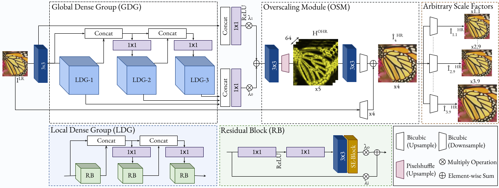
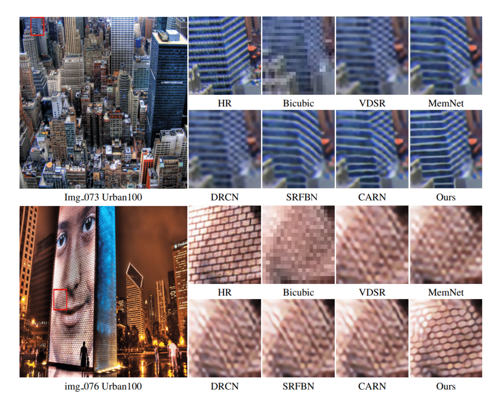

# OverNet-PyTorch
### **This is repository is an official PyTorch implementation of the paper "OverNet: Lightweight Multi-Scale Super-Resolution with Overscaling Network".**
IEEE/CVF Winter Conference on Applications of Computer Vision (WACV), 2021. [[Paper](https://openaccess.thecvf.com/content/WACV2021/papers/Behjati_OverNet_Lightweight_Multi-Scale_Super-Resolution_With_Overscaling_Network_WACV_2021_paper.pdf)] [[arXiv](https://arxiv.org/abs/2012.04578)] 


### Abstract 
Super-resolution (SR) has achieved great success due to the development of deep convolutional neural networks (CNNs). However, as the depth and width of the networks increase, CNN-based SR methods have been faced with the challenge of computational complexity in practice. Moreover, most SR methods train a dedicated model for each target resolution, losing generality and increasing memory requirements. To address these limitations we introduce OverNet, a deep but lightweight convolutional network to solve SISR at arbitrary scale factors with a single model. We make the following contributions: first, we introduce a lightweight feature extractor that enforces efficient reuse of information through a novel recursive structure of skip and dense connections. Second, to maximize the performance of the feature extractor, we propose a model agnostic reconstruction module that generates accurate high-resolution images from overscaled feature maps obtained from any SR architecture. Third, we introduce a multi-scale loss function to achieve generalization across scales. Experiments show that our proposal outperforms previous state-of-the-art approaches in standard benchmarks, while maintaining relatively low computation and memory requirements.




### FAQs
1. The PSNR/SSIM reported in the paper are outdated. We have corrected the error and provided retrained models (DIV2K 1-800) and updated results. 
### Requirements
- Python 3
- [PyTorch](https://github.com/pytorch/pytorch) (0.4.0), [torchvision](https://github.com/pytorch/vision)
- Numpy, Scipy
- Pillow, Scikit-image
- h5py
- importlib


#### Contents
1. [Dataset](#Dataset)
1. [Testing](#Testing)
1. [Training](#Training)
1. [Results](#Results)
1. [Citetion](#Citetion)


### Dataset
We use DIV2K dataset for training and Set5, Set14, B100, and Urban100 dataset for the benchmark test. Here are the following steps to prepare datasets.

1. Download [DIV2K](https://data.vision.ee.ethz.ch/cvl/DIV2K) and unzip on `dataset` directory as below:
  ```
  dataset
  └── DIV2K
      ├── DIV2K_train_HR
      ├── DIV2K_train_LR_bicubic
      ├── DIV2K_valid_HR
      └── DIV2K_valid_LR_bicubic
  ```
2. To accelerate training, we first convert training images to h5 format as follow (h5py module has to be installed).
```shell
$ python div2h5.py
```
3. Other benchmark datasets can be downloaded in [Google Drive](https://drive.google.com/drive/folders/1t2le0-Wz7GZQ4M2mJqmRamw5o4ce2AVw?usp=sharing). Same as DIV2K, please put all the datasets in `dataset` directory.

### Testing
We provide the pretrained models in `checkpoint` directory. To test OverNet on benchmark dataset:
```shell
# Scale factor x2
$ python Sample.py      --test_data_dir dataset/<dataset> --scale 2 --upscale 3 --ckpt_path ./checkpoint/<path>.pth --sample_dir <sample_dir>

# Scale factor x3                
$ python Sample.py      --test_data_dir dataset/<dataset> --scale 3 --upscale 4 --ckpt_path ./checkpoint/<path>.pth --sample_dir <sample_dir>

# Scale factor x4
$ python Sample.py      --test_data_dir dataset/<dataset> --scale 4 --upscale 5 --ckpt_path ./checkpoint/<path>.pth --sample_dir <sample_dir>
```

### Training
Here are our settings to train OverNet. Note: We use two GPU to utilize large batch size, but if OOM error arise, please reduce batch size.
```shell
# Scale factor x2
$ python train.py --patch_size 64 --batch_size 64 --max_steps 600000 --lr 0.001 --decay 150000 --scale 2  --upscale 3

# Scale factor x3
$ python train.py --patch_size 64 --batch_size 64 --max_steps 600000 --lr 0.001 --decay 150000 --scale 3  --upscale 4

# Scale factor x4
$ python train.py --patch_size 64 --batch_size 64 --max_steps 600000 --lr 0.001 --decay 150000 --scale 4  --upscale 5               
                      
 ```

### Results
We provide our qualitative results on four benchmark datasets including Set5, Set14, B100 and Urban100 for scale factor x2, x3, and x4. [[Google Drive](https://drive.google.com/drive/folders/1svSJq8UlU8Yq90tLfByhv_0ctPKv5PiN?usp=sharing)]

<details>
<summary>Lightweight Single Image Super-Resolution (click me)</summary>
<p align="center">

**Note:** The PSNR and SSIM reported in the paper are outdated. We have updated the results as following:
<div align="center">
  
Model|   Scale   |   Set5   |Set14|B100|Urban100|
-----|:---------------------:|:--------------------------:|:-----:|:-------------------------------------:|:-------------------------------:|
 ||| PSNR&nbsp;&nbsp;&nbsp;SSIM |PSNR&nbsp;&nbsp;&nbsp;SSIM|PSNR&nbsp;&nbsp;&nbsp;SSIM|PSNR&nbsp;&nbsp;&nbsp;SSIM|
OverNet (paper)             |x2|38.11&nbsp;&nbsp;&nbsp;0.9610|33.71&nbsp;&nbsp;&nbsp;0.9179|32.24&nbsp;&nbsp;&nbsp;0.9007|32.44&nbsp;&nbsp;&nbsp;0.9311|
 **OverNet**              |x2|38.11&nbsp;&nbsp;&nbsp;0.9608|33.71&nbsp;&nbsp;&nbsp;0.9183|32.24&nbsp;&nbsp;&nbsp;0.8999|32.44&nbsp;&nbsp;&nbsp;0.9304|
OverNet (paper)             |x3|34.49&nbsp;&nbsp;&nbsp;0.9267|30.47&nbsp;&nbsp;&nbsp;0.8436|29.17&nbsp;&nbsp;&nbsp;0.8063|28.37&nbsp;&nbsp;&nbsp;0.8572|
 **OverNet**              |x3|34.46&nbsp;&nbsp;&nbsp;0.9273|30.41&nbsp;&nbsp;&nbsp;0.8429|29.11&nbsp;&nbsp;&nbsp;0.8053|28.29&nbsp;&nbsp;&nbsp;0.8541|
OverNet (paper)             |x4|32.32&nbsp;&nbsp;&nbsp;0.8956|28.71&nbsp;&nbsp;&nbsp;0.7826|27.67&nbsp;&nbsp;&nbsp;0.7373|26.31&nbsp;&nbsp;&nbsp;0.7923|
 **OverNet**              |x4|32.26&nbsp;&nbsp;&nbsp;0.8958|28.64&nbsp;&nbsp;&nbsp;0.7821|27.59&nbsp;&nbsp;&nbsp;0.7364|26.18&nbsp;&nbsp;&nbsp;0.7879|
  



</div>
</p>
</details>


## Citation
```
@inproceedings{behjati2021overnet,
  title={Overnet: Lightweight multi-scale super-resolution with overscaling network},
  author={Behjati, Parichehr and Rodriguez, Pau and Mehri, Armin and Hupont, Isabelle and Tena, Carles Fernandez and Gonzalez, Jordi},
  booktitle={Proceedings of the IEEE/CVF Winter Conference on Applications of Computer Vision},
  pages={2694--2703},
  year={2021}
}
```
This implementation is for non-commercial research use only. If you find this code useful in your research, please cite the above paper. Please also see our other works:

- Frequency-Based Enhancement Network for Efficient Super-Resolution [[Paper](https://ieeexplore.ieee.org/document/9778017)] 
[[Code](https://github.com/pbehjatii/FENet)] 

- Hierarchical Residual Attention Network for Single Image Super-Resolution [[arXiv](https://arxiv.org/abs/2012.04578)]


 
